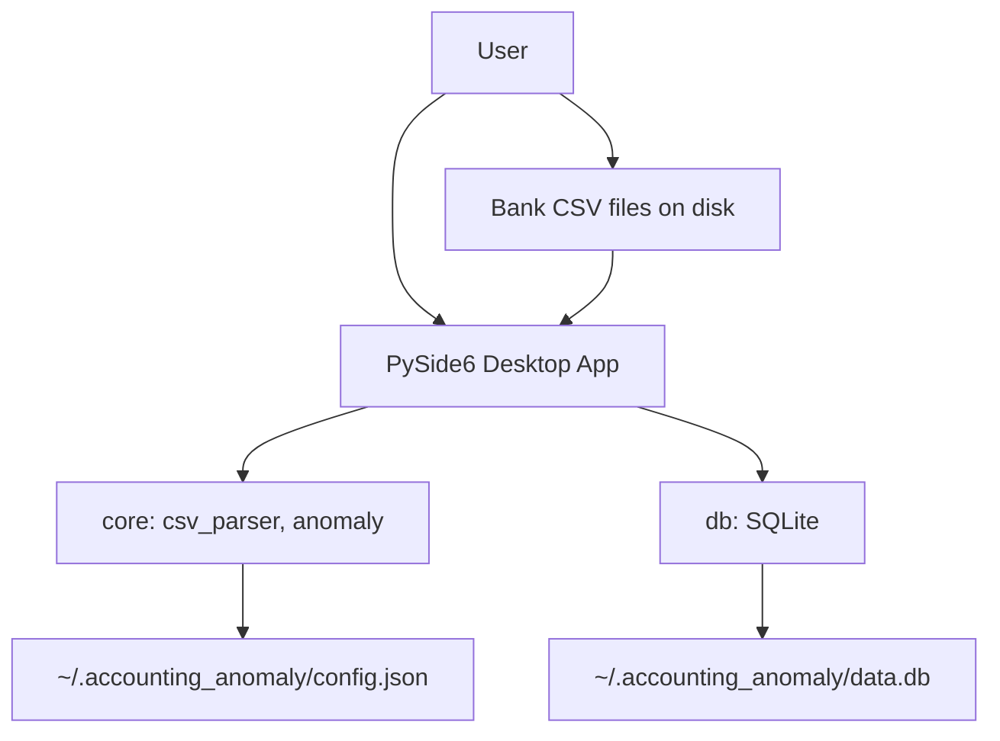
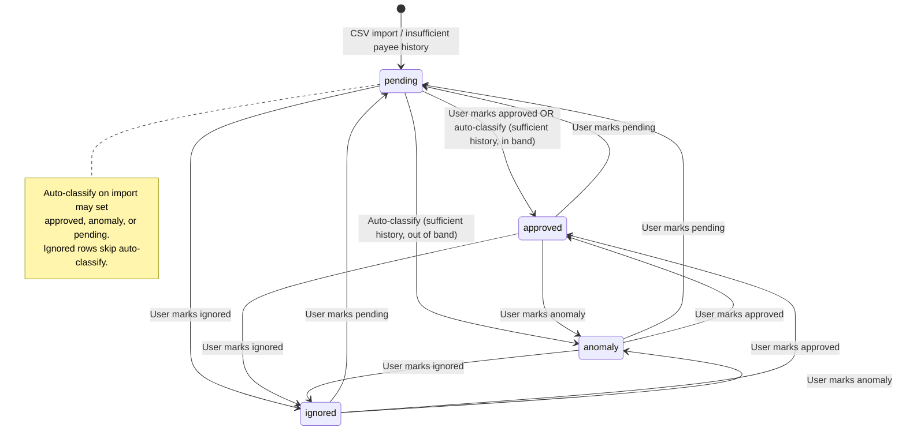
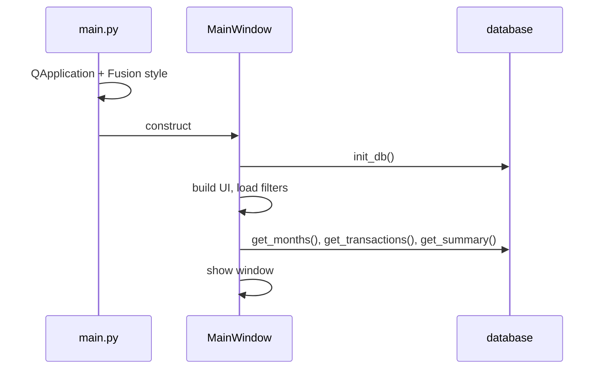
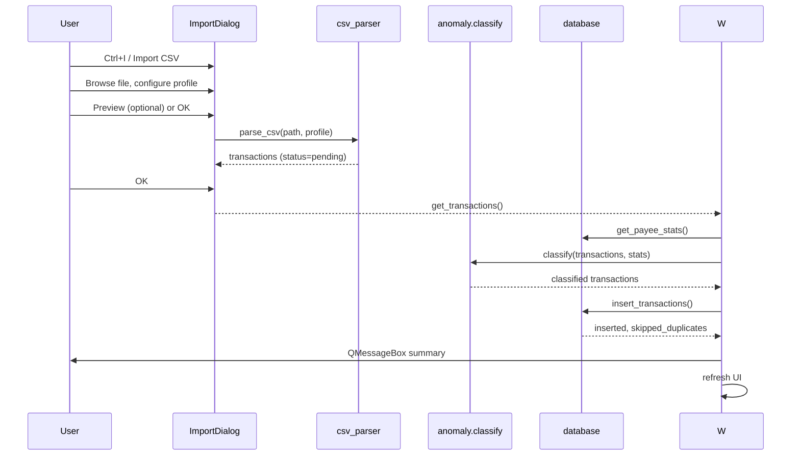
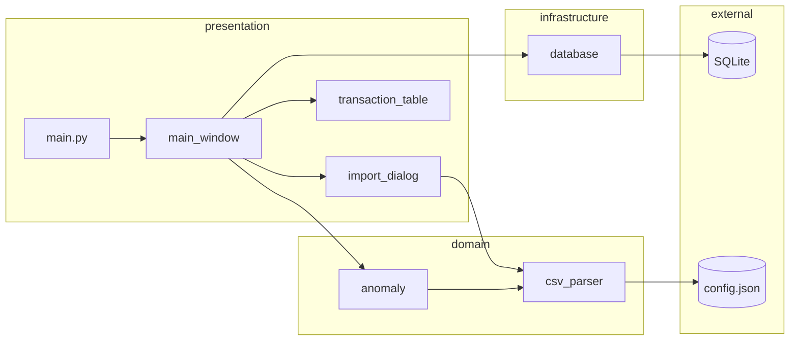
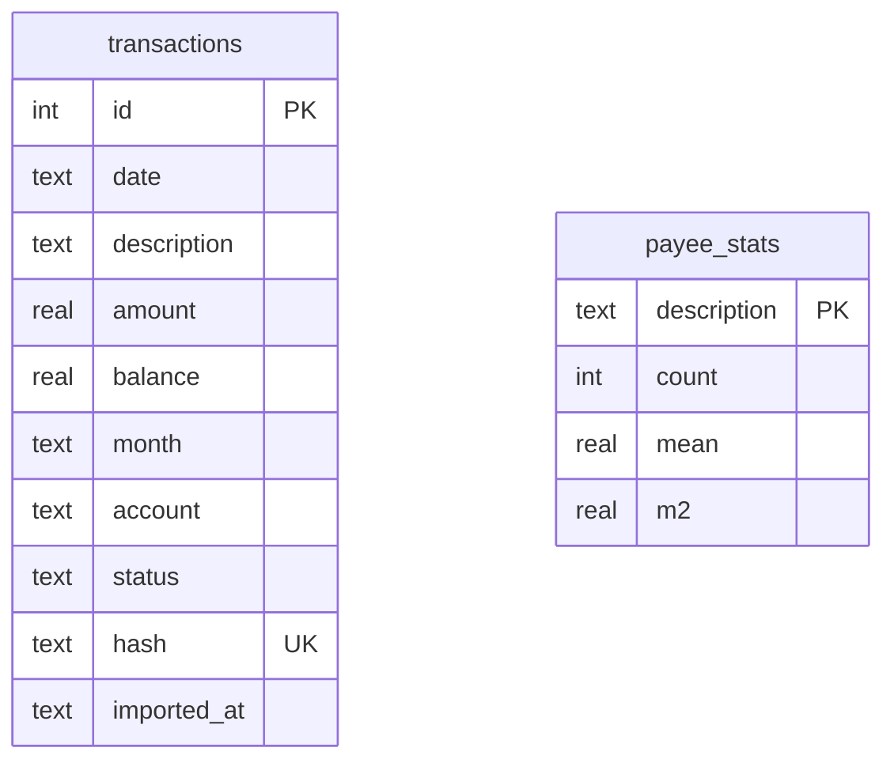

# Development Specification

**Accounting Anomaly Detector** — reverse-engineered from repository evidence.

| Field | Value |
|-------|-------|
| Version | 0.1.0 |
| Spec revision | 1.0 |
| Date | 2026-06-05 |
| Evidence base | `src/`, `tests/`, `README.md`, `pyproject.toml`, `.github/workflows/ci.yml` |

---

## 1. Executive Summary

Accounting Anomaly Detector is a **single-user, local-only desktop application** that helps a person review monthly bank transaction exports. The user imports CSV files, configures per-bank parsing profiles, and reviews transactions that are automatically classified as pending, approved, anomaly, or ignored. Over repeated imports, payees with sufficient approved history can be auto-approved when amounts fall within a statistical band; unusual amounts are flagged as anomalies.

The system stores all persistent data on the user's machine (`~/.accounting_anomaly/`). There is no network layer, authentication, multi-user support, or deployment infrastructure beyond a desktop process and GitHub Actions CI for quality checks.

**Confidence:** High — confirmed by `main.py`, `database.py`, `README.md`, and absence of server/deployment code.

---

## 2. System Overview

### 2.1 Purpose

Reduce manual effort when auditing recurring bank activity by:

1. Importing bank CSV exports with configurable column mapping
2. Detecting duplicate imports safely
3. Auto-classifying transactions using per-payee amount statistics
4. Letting the user override classification via context menu
5. Showing month-level income/expense summaries and review counts

**Confidence:** High — `README.md`, `main_window.py`, `anomaly.py`.

### 2.2 Runtime topology



| Aspect | Implementation |
|--------|----------------|
| Deployment model | Desktop process; `accounting-anomaly` CLI entry (`pyproject.toml`) |
| Process model | Single GUI process, no background jobs or queues |
| External integrations | None (local filesystem only) |
| Auth | None |
| Configuration | JSON profiles in user home directory |
| Persistence | SQLite with WAL journal mode |

**Confidence:** High.

### 2.3 User-visible surfaces

| Surface | Location | Behavior |
|---------|----------|----------|
| Main window | `ui/main_window.py` | Transaction table, filters, summary, import toolbar |
| Import dialog | `ui/import_dialog.py` | File picker, profile editor, raw/parsed preview |
| Context menu | `main_window.py` | Bulk status change on selected rows |
| Status bar | `main_window.py` | Row count, pending count, anomaly count for current filter |

Keyboard shortcut confirmed: **Ctrl+I** imports CSV.

**Confidence:** High.

---

## 3. Domain Model

### 3.1 Core entities

#### Transaction

A single imported bank line item stored in SQLite.

| Attribute | Type | Source | Notes |
|-----------|------|--------|-------|
| `id` | integer | DB auto | Surrogate key |
| `date` | ISO date string (`YYYY-MM-DD`) | Parsed CSV | Stored as TEXT |
| `description` | string | Parsed CSV | Acts as **payee identifier** |
| `amount` | float | Parsed CSV | Signed; negative = expense |
| `balance` | float or null | Optional CSV column | May be absent |
| `month` | `YYYY-MM` | Derived from `date` | Used for filtering and summary |
| `account` | string | Import profile label | Not parsed from a CSV column |
| `status` | enum | Classification + user override | See §3.2 |
| `hash` | string (20 hex chars) | `make_hash(date, description, amount)` | Deduplication key |
| `imported_at` | timestamp | DB default | `datetime('now')` on insert |

**Confidence:** High — `database.py`, `csv_parser.py`.

#### Payee statistics (`payee_stats`)

Rolling aggregate per unique `description` string:

| Field | Meaning |
|-------|---------|
| `count` | Number of **approved** samples recorded |
| `mean` | Running mean of approved amounts |
| `m2` | Welford's sum of squared deviations (for variance) |

Used only for auto-classification on import. Keyed by exact `description` match.

**Confidence:** High — `database.py`, `anomaly.py`.

#### CSV import profile (`CsvProfile`)

Reusable bank-format configuration persisted in `config.json`:

- Delimiter, decimal/thousands separators, encoding
- Column indices (date, description, amount, optional balance)
- `strptime` date format, rows to skip, account label

**Confidence:** High — `csv_parser.py`, `import_dialog.py`.

### 3.2 Transaction status lifecycle



| Status | Meaning (observed) | Included in monthly summary? |
|--------|-------------------|------------------------------|
| `pending` | Needs human review; new payee or &lt; 3 approved samples in stats | Yes |
| `approved` | Known payee, amount within 2.5σ of mean (or exact match when σ=0) | Yes |
| `anomaly` | Known payee, amount outside band | Yes |
| `ignored` | User-excluded (e.g. internal transfers) | **No** |

**Confidence:** High — `README.md`, `anomaly.py`, `get_summary()` SQL.

### 3.3 Domain invariants and rules

| Rule | Detail | Confidence |
|------|--------|------------|
| Payee identity | Exact string match on `description`; no normalization | High |
| Dedup key | `SHA256(date \x00 description \x00 amount[:6 decimals])[:20]`; UNIQUE on `hash` | High |
| Auto-approve threshold | `MIN_HISTORY = 3` approved samples in `payee_stats` | High |
| Anomaly band | `ANOMALY_SIGMA = 2.5` standard deviations from payee mean | High |
| Zero variance | If σ=0: exact amount match → approved, else anomaly | High — `test_anomaly.py` |
| Ignored immutability on import | Rows already `ignored` pass through `classify()` unchanged | High |
| Stats feed | `payee_stats` updated **only** when a transaction becomes `approved` (on insert or `update_status`) | High |
| Stats non-reversal | Changing status away from `approved` does **not** decrement or adjust `payee_stats` | High |
| Parse failures | Malformed CSV rows skipped silently (no user-visible error count) | High |
| Empty description | Row skipped | High |
| Month assignment | From transaction date, not import date | High |

### 3.4 Explicit non-capabilities (not implemented)

Observed absence in codebase:

- Transaction delete or field edit after import
- Export (noted only in `docs/TODO.md`)
- Categories/tags
- Multi-account column mapping (account is a static profile label)
- Undo for status changes
- Schema migrations beyond `CREATE TABLE IF NOT EXISTS`
- Backup/restore UI
- Audit log of user actions

**Confidence:** High — grep and full module review.

---

## 4. Core Business Workflows

### 4.1 Application startup



1. `db.init_db()` ensures schema exists (`database.py`)
2. Main window loads all months into filter combo, default "All months"
3. Transaction table and summary panel refresh

**Confidence:** High.

### 4.2 CSV import



**Steps (confirmed):**

1. User selects CSV (`*.csv`, `*.txt`, or all files)
2. User picks or creates an import profile; may save profile to `config.json` via **Save Profile**
3. **Preview** parses and shows up to raw structure + parsed rows; **OK** auto-runs preview if nothing parsed yet
4. On accept, `classify()` runs against current `payee_stats`
5. `insert_transactions()` inserts each row; `IntegrityError` on duplicate `hash` → counted as skipped
6. Information dialog reports inserted vs duplicate counts

**Side effects:**

- New rows in `transactions`
- `payee_stats` updated only for rows inserted with `status='approved'`
- UI filters and summary refresh

**Confidence:** High.

### 4.3 Manual status review

1. User filters by month and/or status (toolbar combos)
2. User selects one or more rows, right-clicks
3. Chooses: Mark Approved / Ignored / Anomaly / Pending
4. `update_status(tx_id, status)` per selected row
5. If new status is `approved`, payee stats updated with that row's amount
6. Full UI refresh (months combo, table, summary, status bar)

**Bulk operation:** Multi-select applies same status to all selected rows.

**Confidence:** High.

### 4.4 Monthly summary

`get_summary()` aggregates by `month` for all non-ignored transactions:

- **Income:** sum of positive `amount`
- **Expenses:** sum of negative `amount` (displayed as negative)
- **Net:** income + expenses (UI computes in `_SummaryWidget`)
- **Pending / Anomalies:** counts by status

Summary is global (not filtered by toolbar month/status filters). Transaction table **is** filtered.

**Confidence:** High.

---

## 5. Functional Behavior

### 5.1 CSV parsing

**Input:** File path + `CsvProfile`

**Processing (`parse_csv`):**

1. Read file with configured encoding (`errors="replace"` on decode)
2. Parse with `csv.reader` and profile delimiter
3. Skip first N rows per `skip_rows`; row N becomes header reference for raw preview only
4. For each subsequent row:
   - Skip blank rows
   - Parse date with `datetime.strptime`
   - Require non-empty description
   - Parse amount via `parse_amount` (handles thousands sep, decimal sep, parentheses negatives)
   - Optionally parse balance column if `balance_col >= 0`
5. Emit dict with `status: "pending"` always

**Output:** List of transaction dicts (in-memory only until import completes)

**Failure handling:** Per-row `ValueError`/`IndexError` → row dropped silently

**Confidence:** High — `csv_parser.py`, `tests/test_csv_parser.py`.

### 5.2 Anomaly classification

**Input:** Transaction list + `payee_stats` map

**Algorithm (`classify`):**

For each transaction (unless already `ignored`):

1. Look up stats by `description`
2. If no stats or `count < MIN_HISTORY (3)` → `pending`
3. Else compute sample std dev from Welford `m2` and `count`
4. If deviation from mean ≤ `2.5 × σ` → `approved`
5. If σ = 0 → `approved` only when deviation = 0, else `anomaly`
6. Else → `anomaly`

**Output:** Same transactions with `status` field set

**Not used at:** Manual status change time (only at import)

**Confidence:** High — `anomaly.py`, `tests/test_anomaly.py`.

### 5.3 Persistence operations

| Operation | Behavior |
|-----------|----------|
| `init_db` | Create tables if missing |
| `insert_transactions` | Insert batch; count duplicates via unique `hash` |
| `get_transactions` | Filter by optional month/status; order `date DESC, id DESC` |
| `update_status` | Set status; conditionally update payee stats |
| `get_months` | Distinct months descending |
| `get_payee_stats` | Full map for classification |
| `get_summary` | Monthly aggregates excluding ignored |

**Transactional boundaries:** Each public DB function opens its own connection context; `insert_transactions` uses one transaction for the whole batch.

**Confidence:** High.

---

## 6. Architecture Overview

### 6.1 Style

**Layered desktop monolith** with strict dependency direction:

```
ui/  →  db/, core/
core/  →  (stdlib only)
db/  →  (stdlib + sqlite3)
main.py  →  ui/
```

`core/` has no Qt imports — unit-tested in isolation.

**Confidence:** High.

### 6.2 Dependency diagram



### 6.3 Coupling and boundaries

| Boundary | Coupling risk |
|----------|---------------|
| UI ↔ DB | UI calls `db` module directly; no repository abstraction |
| UI ↔ Core | Import flow orchestrates classify + insert in `MainWindow` |
| Core ↔ DB | Independent; stats passed as plain dicts |
| Config ↔ CSV | `csv_parser` owns profile load/save paths |

**Confidence:** High.

---

## 7. Module / Subdomain Breakdown

### 7.1 `main.py`

| | |
|-|-|
| **Purpose** | Process entry point |
| **Responsibilities** | Start Qt app, show `MainWindow` |
| **Dependencies** | PySide6, `ui.main_window` |
| **Failure modes** | Standard Qt startup failures (display unavailable in headless without `QT_QPA_PLATFORM`) |

### 7.2 `core/csv_parser.py`

| | |
|-|-|
| **Purpose** | Bank CSV interpretation and profile persistence |
| **Inputs** | File path, `CsvProfile` |
| **Outputs** | Parsed transaction dicts; profile list to/from JSON |
| **Key behaviors** | European-style defaults (`;`, `,` decimal); silent row skip |
| **Failure modes** | File read errors surfaced in import dialog; per-row parse drops |

### 7.3 `core/anomaly.py`

| | |
|-|-|
| **Purpose** | Statistical auto-classification |
| **Inputs** | Transactions, payee stats snapshot |
| **Outputs** | Transactions with status assigned |
| **Constants** | `ANOMALY_SIGMA=2.5`, `MIN_HISTORY=3` |
| **Failure modes** | None explicit; relies on valid numeric stats |

### 7.4 `db/database.py`

| | |
|-|-|
| **Purpose** | SQLite schema and all persistence |
| **Storage** | `~/.accounting_anomaly/data.db` |
| **PRAGMAs** | WAL journal, foreign keys on |
| **Failure modes** | `IntegrityError` swallowed for duplicates; other DB errors propagate |

### 7.5 `ui/main_window.py`

| | |
|-|-|
| **Purpose** | Primary application shell |
| **Responsibilities** | Import orchestration, filtering, summary, status menu |
| **Outputs** | User messages, refreshed views |

### 7.6 `ui/import_dialog.py`

| | |
|-|-|
| **Purpose** | Import wizard modal |
| **Responsibilities** | Profile CRUD UI, raw preview (100 rows), parsed preview |
| **Persistence** | Profiles saved only on explicit Save Profile |

### 7.7 `ui/transaction_table.py`

| | |
|-|-|
| **Purpose** | `QAbstractTableModel` for transaction grid |
| **Behaviors** | Status-based row background colors; amount formatting `+/-` |

---

## 8. Data Model and Persistence

### 8.1 ER diagram



**Relationship:** Logical link `transactions.description` → `payee_stats.description`. **No foreign key** enforced in schema.

**Confidence:** High.

### 8.2 Consistency assumptions

| Assumption | Reality in code |
|------------|-----------------|
| Single writer | One desktop app instance assumed; no file locking beyond SQLite |
| Stats reflect approved history | Approximate — stats never decrease when status changes away from approved |
| Dedup is content-based | Same date+description+amount always skipped; account not in hash |
| Schema evolution | New columns require manual migration; only `IF NOT EXISTS` bootstrap |

**Confidence:** High.

### 8.3 Data ownership

| Data | Owner path | Lifetime |
|------|------------|----------|
| Transactions + stats | `~/.accounting_anomaly/data.db` | Until user deletes |
| Import profiles | `~/.accounting_anomaly/config.json` | Until user deletes |
| Source CSVs | User filesystem | Outside app control |

---

## 9. Integration Points

| Integration | Direction | Protocol | Notes |
|-------------|-----------|----------|-------|
| Bank CSV files | Inbound | Local filesystem | User picks via `QFileDialog` |
| User home config | Read/write | JSON file | Created on first save |
| SQLite | Read/write | File-based | Auto-created on first DB op |
| External APIs | — | None | — |
| OS display | Outbound | Qt platform plugin | CI uses `offscreen` |

**Confidence:** High.

---

## 10. Security and Access Control

| Topic | Current behavior |
|-------|------------------|
| Authentication | None |
| Authorization | N/A — single local user |
| Data encryption | None at rest |
| Network exposure | None |
| Sensitive data | Full transaction history in plaintext SQLite |
| Input validation | CSV parsing tolerant; SQL uses parameterized queries |
| Path traversal | User-selected import paths read directly |

**Implied requirement:** Suitable only for personal use on a trusted machine. Bank data sensitivity acknowledged in `README.md` / `AGENTS.md`.

**Confidence:** High.

---

## 11. Operational Characteristics

### 11.1 Build and run

| Command | Purpose |
|---------|---------|
| `uv pip install -e ".[dev]"` | Install package + dev tools |
| `accounting-anomaly` | Launch GUI |
| `pytest tests/ -v` | Unit tests (14 tests) |
| `ruff check/format` | Lint and format |

### 11.2 CI (`.github/workflows/ci.yml`)

- Trigger: push to `main`, all pull requests
- Ubuntu, Python 3.11, installs system GL libs for PySide6
- Runs ruff check, ruff format check, pytest with `QT_QPA_PLATFORM=offscreen`

### 11.3 Observability

- No structured logging
- User feedback via `QMessageBox` and status bar text
- No metrics, tracing, or crash reporting

**Confidence:** High.

### 11.4 Failure and recovery

| Failure | System response |
|---------|-----------------|
| Duplicate import | Row skipped; count shown to user |
| CSV read error | Warning dialog in import UI |
| Empty parse on OK | Warning "Nothing to import"; dialog stays open |
| DB corruption | Not handled explicitly |
| App crash mid-import | Batch insert uses single connection; partial batch may commit per SQLite transaction semantics |

**Confidence:** Medium on partial-import behavior — SQLite autocommit per statement unless explicit transaction; `insert_transactions` does not wrap explicit `BEGIN/COMMIT`.

---

## 12. Non-Functional Requirements

### 12.1 Explicit (implemented)

| NFR | Evidence |
|-----|----------|
| Local-first privacy | All data in user home directory |
| Idempotent import | Hash-based deduplication |
| Testability of core logic | `core/` free of Qt; 14 unit tests |
| Code quality gate | Ruff + pytest in CI |
| Desktop UX | Native Qt widgets, Fusion style |

### 12.2 Implied (not formally guaranteed)

| NFR | Inference | Confidence |
|-----|-----------|------------|
| Single-user scale | SQLite + full-table reads for filters | High |
| modest data volume | No pagination; all matching rows loaded into model | High |
| Interactive responsiveness | Synchronous file parse on UI thread | Medium |
| Statistical correctness | Welford + sample std (n-1 denominator) | High |
| Portability | Python 3.11+, PySide6; Linux CI + likely macOS/Windows desktop | Medium |

### 12.3 Not addressed

- High availability, horizontal scale, backup, GDPR tooling, multi-device sync, accessibility (a11y), i18n/l10n

---

## 13. Risks and Technical Debt

| Risk | Severity | Evidence |
|------|----------|----------|
| **Payee stats drift** | Medium | Approving then reclassifying does not undo stats; repeated anomalies may still leave inflated counts/means |
| **Payee string fragility** | Medium | `"Coffee Shop"` vs `"COFFEE SHOP"` treated as different payees |
| **Dedup omits account** | Medium | Same amount/date/description from two accounts collides |
| **Silent parse drops** | Medium | User not told how many rows failed parsing |
| **UI-thread parsing** | Low–Medium | Large CSV may freeze UI during preview/import |
| **No migrations** | Medium | Schema changes break existing user DBs without upgrade path |
| **No GUI tests** | Medium | Regressions in import/review flow undetected by CI |
| **Import profile not auto-saved** | Low | User may forget Save Profile after edits |
| **No delete/edit** | Low (product) | Errors require status workarounds or DB surgery |

---

## 14. Known Unknowns and Validation Needed

### Q1: Should payee stats update when status changes *from* approved?

| | |
|-|-|
| **Why it matters** | Affects long-term auto-classification accuracy |
| **Spec sections** | §3.3, §4.3, §13 |
| **Missing evidence** | Product intent; no tests for status-change impact on stats |
| **Options** | (A) Current: append-only stats (B) Recompute stats from all approved rows on change (C) Welford reverse step |
| **Impact** | **High** |

### Q2: Should deduplication include `account` or `balance`?

| | |
|-|-|
| **Why it matters** | Multi-account users may see false duplicates or missed duplicates |
| **Spec sections** | §3.3, §8.2 |
| **Missing evidence** | User workflow for multiple accounts |
| **Options** | (A) Keep date+description+amount (B) Add account to hash (C) Add bank-defined unique ID column |
| **Impact** | **Medium** |

### Q3: Is silent row skipping acceptable on import?

| | |
|-|-|
| **Why it matters** | User may believe all rows imported when some were dropped |
| **Spec sections** | §5.1, §4.2 |
| **Missing evidence** | UX requirements |
| **Options** | (A) Silent skip (current) (B) Show parse error count (C) Fail import if any row invalid |
| **Impact** | **Medium** |

### Q4: Should `payee_stats` use normalized payee names?

| | |
|-|-|
| **Why it matters** | Split history across description variants |
| **Spec sections** | §3.1, §5.2 |
| **Missing evidence** | Real bank CSV description formats |
| **Impact** | **Medium** |

### Q5: Is single-connection insert transactional all-or-nothing?

| | |
|-|-|
| **Why it matters** | Partial imports after crash |
| **Spec sections** | §11.4 |
| **Missing evidence** | Explicit `BEGIN`/`COMMIT` wrapping |
| **Likely answer** | SQLite default; partial inserts possible |
| **Impact** | **Low** |

### Q6: Planned features in `docs/TODO.md` — priority?

Keyboard shortcuts, export, charts, categories are **not implemented**. Treat as roadmap, not current spec.

**Impact:** Low for current behavior documentation.

---

## 15. Appendix

### 15.1 Test coverage map

| Module | Tests | Coverage focus |
|--------|-------|----------------|
| `csv_parser.parse_amount` | 5 tests | European/US formats, negatives, parentheses |
| `csv_parser.parse_csv` | 2 tests | Basic parse, empty row skip |
| `anomaly.classify` | 7 tests | All status branches, σ=0 edge case |
| `db/*`, `ui/*` | None | — |

### 15.2 Key constants

| Constant | Value | Location |
|----------|-------|----------|
| `ANOMALY_SIGMA` | 2.5 | `core/anomaly.py` |
| `MIN_HISTORY` | 3 | `core/anomaly.py` |
| Default delimiter | `;` | `CsvProfile` |
| Default decimal | `,` | `CsvProfile` |
| Default date format | `%d.%m.%Y` | `CsvProfile` |

### 15.3 File index

| Path | Role |
|------|------|
| `src/accounting_anomaly/main.py` | Entry |
| `src/accounting_anomaly/core/csv_parser.py` | CSV + profiles |
| `src/accounting_anomaly/core/anomaly.py` | Classification |
| `src/accounting_anomaly/db/database.py` | Persistence |
| `src/accounting_anomaly/ui/main_window.py` | Shell |
| `src/accounting_anomaly/ui/import_dialog.py` | Import UX |
| `src/accounting_anomaly/ui/transaction_table.py` | Table model |
| `tests/test_*.py` | Unit tests |

### 15.4 Planned enhancements (not in codebase)

From `docs/TODO.md`:

1. Real bank CSV tuning
2. Category tagging
3. Keyboard shortcuts (A/I/X)
4. Export CSV/PDF
5. Chart view (QChart or matplotlib)

---

## 16. Changelog / Revision History

| Revision | Date | Author | Changes |
|----------|------|--------|---------|
| 1.0 | 2026-06-05 | Reverse-engineered from codebase | Initial specification from `src/`, `tests/`, config, CI |

---

*When product questions in §14 are answered, update affected sections, adjust confidence labels, and append a changelog entry.*
